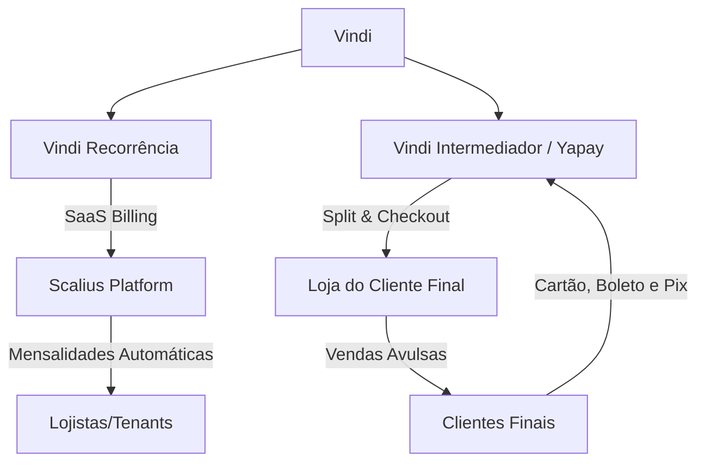

# Scalius - Plataforma SaaS Multi-tenant para Pedidos Online

O **Scalius** é um sistema SaaS multi-tenant robusto projetado para permitir que pequenas lojas locais (floriculturas, confeitarias, artesanato, etc.) criem sua própria vitrine de vendas online. A plataforma possibilita que os lojistas gerenciem seus produtos, controlem estoque, configurem fretes e recebam pagamentos automaticamente, integrando tudo de ponta a ponta com o WhatsApp e gateways de pagamento.

---

## 🛠️ Stack Tecnológica

### Frontend
- **React 18** com **TypeScript** e **Vite**
- **React Router v6** para gerenciamento de rotas
- **Tailwind CSS** + **shadcn/ui** para interface e design system
- **TanStack Query (v5)** para gerenciamento e sincronização de dados de servidor
- **Recharts** para relatórios e gráficos analíticos
- **Framer Motion** para animações interativas e micro-interações
- **Lucide React** & **Sonner** para ícones e notificações *toast*

### Backend & Infraestrutura (Supabase)
- **PostgreSQL** com isolamento total dos dados por loja através de **Row Level Security (RLS)**
- **Supabase Auth** para gestão segura de sessões e perfis de usuários (lojistas e clientes)
- **Supabase Storage** para armazenamento de mídias (logos, banners, imagens de produtos)
- **Supabase Edge Functions (Deno)** para integrações externas seguras e processamento assíncrono (Webhooks, Envio de E-mails, Cálculos de Envio e Gateways de Pagamento)
- **PostgreSQL Functions (RPCs) & Triggers** para transações críticas de banco de dados (como criação segura de pedidos e controle de planos)

---

## 👥 Níveis de Acesso e Funcionalidades

### 1. Cliente (Loja Pública)
Disponível em domínio/subdomínio próprio ou sob o path `/loja/:slug`.
- **Vitrine Dinâmica**: Visualização de produtos organizados por categorias, busca textual, filtros e destaque de produtos.
- **Carrinho de Compras**: Gestão local e persistência dos itens adicionados.
- **Checkout Inteligente**:
  - Cadastro e autenticação rápidos do cliente.
  - Cálculo de frete dinâmico: por regiões/bairro configurados ou por distância.
  - Integração com **Melhor Envio** para cotação automatizada de fretes nacionais.
- **Meios de Pagamento**:
  - **Pix Manual**: Exibição da chave Pix do lojista e inserção opcional do nome do pagador para validação manual.
  - **Pix Automático (Mercado Pago)**: Geração de QR Code e código *Copia e Cola* com expiração controlada e confirmação em tempo real.
- **Rastreamento de Pedido**: Página dedicada com atualizações de status em tempo real e botão direto para contato via WhatsApp.

### 2. Lojista (Painel Administrativo)
Disponível sob o path `/admin` após login e validação de membro do tenant.
- **Dashboard e Métricas**: Visão geral de faturamento, novos pedidos e gráficos analíticos alimentados pelo Recharts.
- **Gestão do Catálogo**: CRUD de produtos (nome, descrição, preço, estoque, destaque e imagens) e categorias.
- **Fluxo de Pedidos**: Acompanhamento detalhado do status do pedido (Pendente → Em Preparação → Pronto para Envio → Entregue/Finalizado) com controle de pagamento.
- **Configurações de Frete**:
  - Alternância entre frete por **Região** (cadastro de bairros e taxas fixas) ou por **Distância** (preço por Km).
  - Configuração do **Melhor Envio** (Tokens de Produção/Sandbox e regras de seguro de carga).
- **Configurações da Loja**: Customização de identidade visual (logo, banner, cores primárias), WhatsApp de suporte e preferência de alertas sonoros de novos pedidos.
- **Integração de Pagamento**: Conexão simples via OAuth com o Mercado Pago e ativação de provedores.

### 3. Super Admin
Disponível sob o path `/super-admin` apenas para perfis globais autorizados.
- **Controle de Tenants**: Monitoramento de todas as lojas criadas na plataforma.
- **Gestão de Planos**: Alteração e atribuição dos planos SaaS para cada loja cadastrada.

---

## 💎 Planos de Assinatura (SaaS Billing)

A plataforma impõe limites de uso no banco de dados e regras de negócio com base no plano contratado pelo lojista (definido na tabela `stores.plan`):

1. **Básico (`basico`)**
   - Limite de 1 usuário administrador por loja.
   - Limite de 1 sessão simultânea ativa (controlado por limpeza de token no banco).
2. **Profissional (`essencial`)**
   - Limite de até 2 usuários administradores por loja.
   - Limite de até 2 sessões simultâneas ativas por loja.
3. **Pro (`pro`)**
   - Usuários administradores ilimitados.
   - Sessões simultâneas ilimitadas.
   - Recursos avançados ativados (ex: emissão simplificada de etiquetas do Melhor Envio).

---

## 📂 Estrutura do Projeto Frontend

```bash
src/
├── components/
│   ├── admin/          # Componentes do painel do lojista (Dashboard, Pedidos, Configurações)
│   ├── auth/           # Formulários de Login, Redefinição de Senha e Provedores de Proteção (Guards)
│   ├── layouts/        # Layout base para Área Pública, Painel Admin e Super Admin
│   ├── store/          # Componentes da vitrine (Filtros, Menu de Categorias, Cards de Produtos)
│   └── ui/             # Biblioteca de componentes visuais reutilizáveis (botões, modais, inputs)
├── contexts/
│   ├── AuthContext.tsx      # Controle de sessão do usuário logado e verificação de nível de acesso
│   ├── TenantContext.tsx    # Carrega e fornece as configurações e informações da loja atual (SaaS)
│   ├── CartContext.tsx      # Lógica e estado global do carrinho de compras do cliente
│   └── ThemeContext.tsx     # Gerenciamento de tema (Claro/Escuro)
├── hooks/                   # Custom hooks (ex: useActiveStore, useStoreSettings)
├── integrations/
│   └── supabase/            # Inicialização do cliente Supabase e tipagem TypeScript auto-gerada
├── lib/
│   ├── mockData.ts          # Utilitários de formatação de valores monetários e mocks iniciais
│   └── tenant.ts            # Lógica para resolver o slug do tenant via subdomínio ou URL
├── pages/
│   ├── admin/               # Páginas do Painel Administrativo do lojista
│   ├── public/              # Páginas da vitrine pública de vendas
│   ├── super-admin/         # Páginas administrativas da plataforma global
│   ├── Index.tsx            # Landing page institucional do Scalius
│   └── Login.tsx            # Página de autenticação unificada
├── types/
│   └── database.ts          # Extensão das definições de tipos para o banco de dados
└── App.tsx                  # Arquivo principal com mapeamento de rotas públicas, privadas e subdomínios
```

---

## 🗄️ Arquitetura do Banco de Dados

### Tabelas Principais (Esquema Público)
- **`stores`**: Registro da loja, slug único, plano contratado (`basico` | `essencial` | `pro`) e status operacional.
- **`store_settings`**: Configurações específicas da loja (nome, WhatsApp, logo, banner, chaves Pix, modo de frete, preferências sonoras e tokens de envio).
- **`profiles`**: Perfis dos usuários associados.
- **`store_members`**: Tabela de junção que vincula perfis a lojas com regras específicas (`owner`, `admin`, `staff`).
- **`categories`** & **`products`**: Estrutura do catálogo de vendas de cada tenant.
- **`orders`** & **`order_items`**: Armazenamento e detalhamento de vendas com histórico de status de entrega e de pagamento.
- **`shipping_regions`**: Tabela de apoio para cobrança de frete por bairro/região.
- **`store_sessions`**: Registro e monitoramento das sessões ativas para aplicação das regras de simultaneidade do plano.
- **`store_secrets`**: Tabela ultra restrita via RLS para armazenamento de tokens críticos (ex: credenciais do Mercado Pago e Melhor Envio).

---

## ⚙️ Configuração e Instalação Local

### Pré-requisitos
- **Node.js** v18+ e npm.
- **Supabase CLI** (opcional, para gerenciamento de migrations locais).
- Conta no Supabase (para criar o banco de dados de desenvolvimento).

### Passo a Passo

1. **Clone o repositório:**
   ```bash
   git clone https://github.com/NightCombed/scalius-vitrine.git
   cd scalius-vitrine/Scalius_Vitrine
   ```

2. **Instale as dependências:**
   ```bash
   npm install
   ```

3. **Configure as variáveis de ambiente:**
   Crie um arquivo `.env` na raiz do projeto:
   ```env
   VITE_SUPABASE_URL=sua_url_do_supabase_aqui
   VITE_SUPABASE_ANON_KEY=sua_chave_anonima_do_supabase_aqui
   ```

4. **Execute as migrations no seu banco de dados Supabase:**
   Aplique os scripts SQL localizados na pasta `supabase/migrations/` em ordem cronológica através do console do Supabase ou usando a CLI do Supabase.

5. **Inicie o servidor de desenvolvimento:**
   ```bash
   npm run dev
   ```
   Abra [http://localhost:5173](http://localhost:5173) no seu navegador. Para testar o comportamento multi-tenant de forma local, acesse [http://localhost:5173/loja/nome-da-sua-loja](http://localhost:5173/loja/nome-da-sua-loja).

---

## 📡 Supabase Edge Functions

O Scalius utiliza as Edge Functions para processos de backend seguros. Principais funções contidas em `supabase/functions/`:
- **`mercadopago-pix`**: Cria cobranças automáticas do tipo Pix gerando o QR Code e o ID do pagamento.
- **`mercadopago-webhook`**: Ouve notificações de atualização de status de pagamento do Mercado Pago e muda o status de orders para `paid` de forma instantânea.
- **`mercadopago-oauth`**: Trata o redirecionamento OAuth do Mercado Pago, gerando tokens específicos e salvando-os de forma criptografada na tabela `store_secrets`.
- **`calculate-shipping`**: Integra-se com a API do Melhor Envio para cotar os prazos e taxas de entrega dos Correios, Jadlog, Loggi, etc.
- **`send-notification`**: Dispara alertas de novos pedidos via e-mail e prepara envios de notificação de WhatsApp.

---

## 🗺️ Roadmap de Integração de Pagamento: Vindi Pagamentos

Uma futura melhoria planejada na arquitetura de pagamentos é a integração com a **Vindi Pagamentos**, expandindo a capacidade do ecossistema em duas frentes:



### 1. Cobrança de Assinaturas (SaaS) com Vindi Recorrência
Automatiza a cobrança das mensalidades dos lojistas de forma nativa e profissional:
- O lojista é cadastrado como um `customer` na Vindi.
- É criada uma `subscription` atrelada ao plano correspondente (`basico`, `essencial` ou `pro`).
- Uma nova Edge Function (`vindi-subscription-webhook`) ouvirá os eventos de faturas pagas ou atrasadas da Vindi, atualizando o campo `plan` na tabela `stores` automaticamente para liberar ou suspender o acesso do lojista.

### 2. Gateway e Split de Vendas com Vindi Intermediador
Facilita o processamento das vendas das lojas clientes com comissionamento:
- **Cartão de Crédito com Antifraude**: Libera a opção de compras por cartão de crédito diretamente no checkout do cliente final, reduzindo riscos de *chargeback*.
- **Split de Pagamentos**: Permite que o Scalius retenha uma porcentagem de cada transação (por exemplo, 1% de taxa por pedido pago) automaticamente no momento do pagamento, enviando a taxa para o saldo da plataforma e o valor principal para a conta bancária do lojista na Vindi.